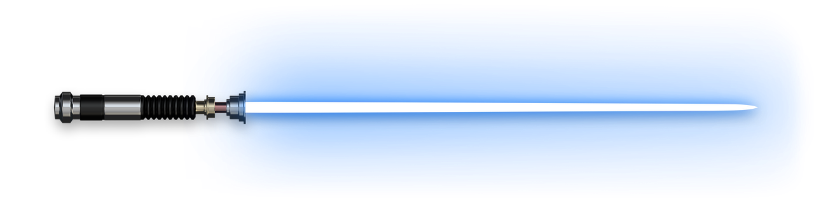

## Sup, I'm Siddhartha

  

## Bio: 

Third Year CS Undergrad @ MIT-WPU

I enjoy experimenting with and making cool stuff (that may or may not be useful).

B.Tech CSE | Specialization in Artifical Intelligence and Data Science

  

## Areas of Interest:

**Machine Learning | Deep Learning | Reinforcement Learning | Game Dev | GPU Computing | Competitive Programming**

  

## Currently Learning: 

**CUDA | Unity**

  

## Tech Stack

### Languages

### AI / ML

### Tools & Technologies

  

## Featured Projects

### [DSP-Assisted Residual RF Denoising (Ongoing)](https://github.com/PenguinnSid/DSP-Assisted-Residual-RF-Denoising-)

A hybrid DSP + deep learning pipeline for removing residual noise from BPSK/QPSK RF signals under AWGN and Rayleigh fading.

### [Reinforcement Learning Platformer](https://github.com/PenguinnSid/Reinforcement-Learning-2d-Platformer)

A PPO based agent trained to navigate a 2D platformer using a custom Gymnasium environment and Godot game engine.

  

## GitHub Stats

